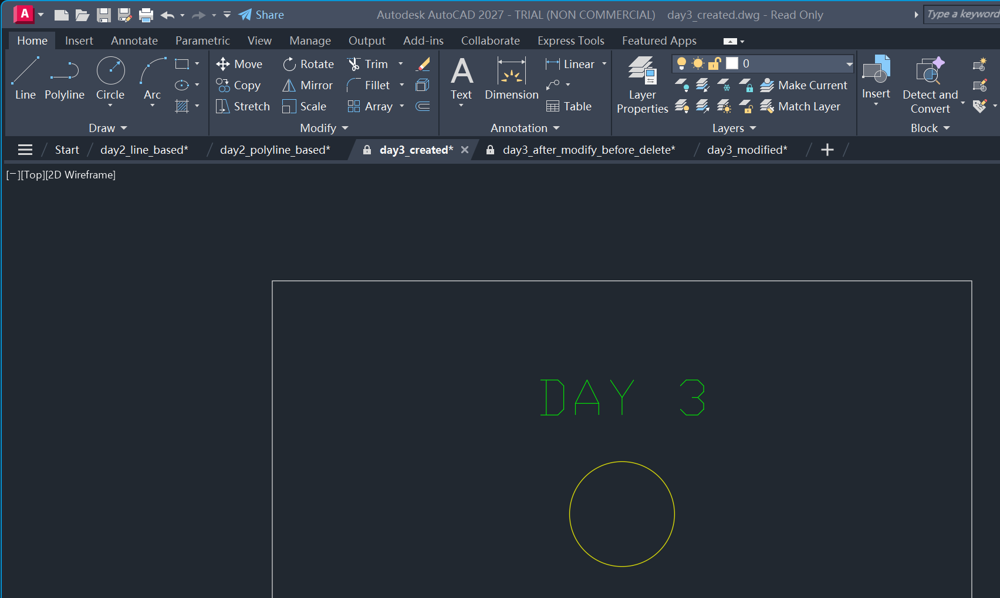
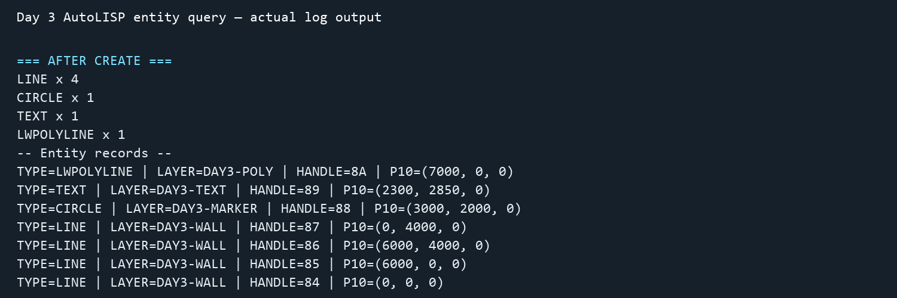
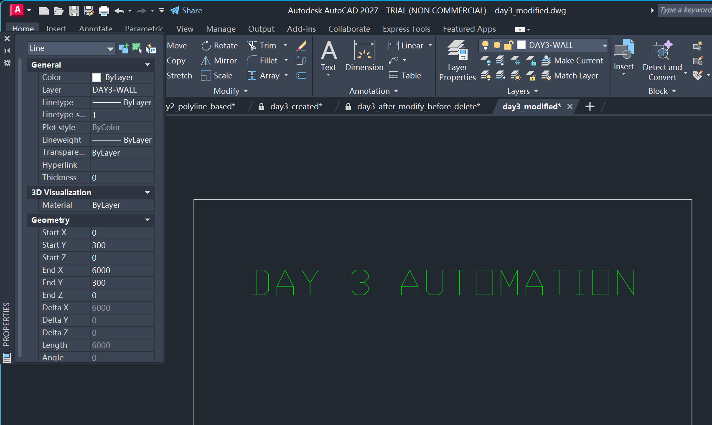
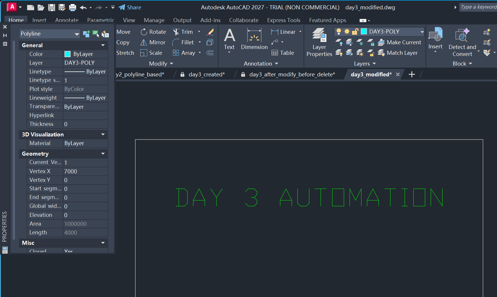
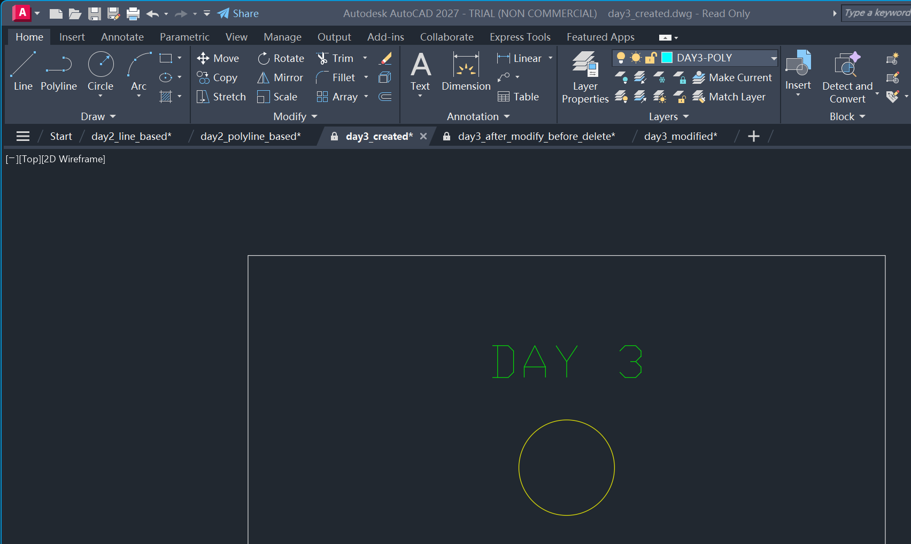
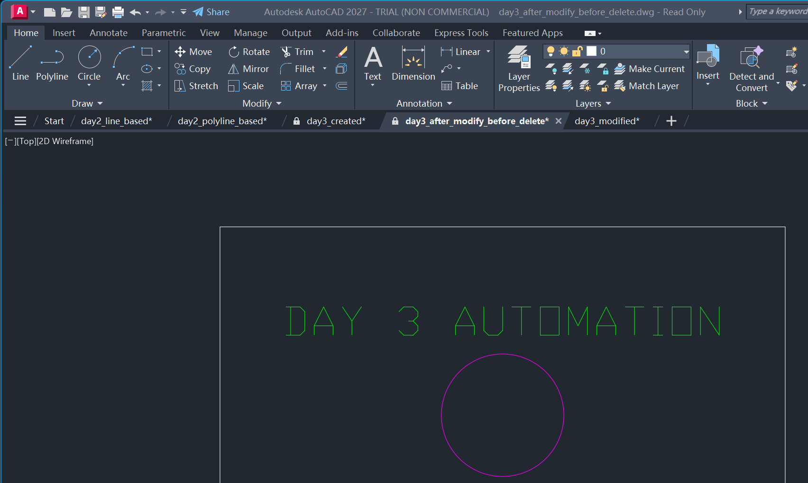
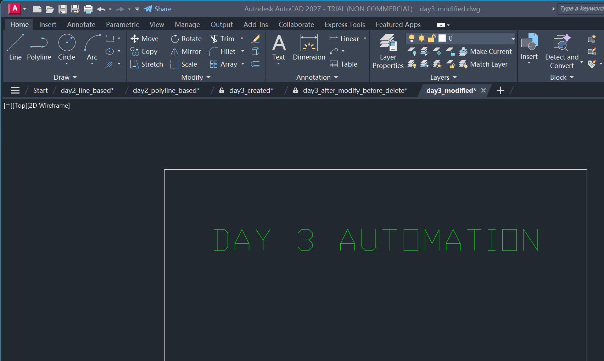

# Day 3 — AutoCAD Automation

## 1. 今日目标

把「画图」当作可验证的软件工程流程：

`code -> AutoCAD -> create -> query -> modify -> delete -> save -> reopen -> query`

本次任务实际在 AutoCAD 2027 Trial (Non-Commercial) 中完成。AutoLISP 已在你手动批准 AutoCAD 的未签名 LISP 加载安全提示后实际加载并运行。DWG 数据库随后通过 AutoCAD COM 再次查询，而不是仅根据命令行假定成功。

## 2. 文件与产物

| 目录 | 用途 |
| --- | --- |
| `src/` | AutoLISP、运行与验证脚本、.NET 学习示例 |
| `output/` | `day3_created.dwg` 与最终 `day3_modified.dwg` |
| `screenshots/` | 本教程使用的 01–08 证据图 |
| `logs/` | 实体查询日志与执行报告 |
| `docs/` | 本教程 |

核心脚本：

- [day3_automation.lsp](../src/day3_automation.lsp)：实际加载并执行的 AutoLISP。
- [run_day3_autocad_lab.py](../src/run_day3_autocad_lab.py)：AutoCAD COM 编排、保存与重开验证。
- [AutoCadDotNetExample.cs](../src/AutoCadDotNetExample.cs)：仅用于理解 .NET API 的教学片段。
- [validate_day3_lab.py](../src/validate_day3_lab.py)：对报告、日志、DWG 和证据图做离线一致性检查。

## 3. AutoLISP：把 CAD 命令封装为函数

`day3_automation.lsp` 定义了以下可复用函数：

```lisp
day3:create-line
day3:create-polyline
day3:create-text
day3:create-circle
day3:query-entities
day3:move-entity
day3:delete-entity
day3:save-drawing
```

以及四个实际执行命令：`DAY3CREATE`、`DAY3QUERY`、`DAY3MODIFY`、`DAY3DELETE`。这里的重点不是背命令，而是把重复、可预测的建模动作封装成能反复执行的代码。

## 4. 创建：结构化实体而非手工涂画

`DAY3CREATE` 生成以下模型空间对象，并写入 `output/day3_created.dwg`：

| 对象 | 数量 | 图层 | 关键数据 |
| --- | ---: | --- | --- |
| LINE | 4 | `DAY3-WALL` | 6000 × 4000 房间边界 |
| CIRCLE | 1 | `DAY3-MARKER` | 圆心 `(3000,2000)`，初始半径 450 |
| TEXT | 1 | `DAY3-TEXT` | `DAY 3` |
| LWPOLYLINE | 1 | `DAY3-POLY` | 独立封闭矩形 |



图层是语义，而不只是颜色：墙、标记、文字和多段线被分离，因此后续可以按图层查询、批量修改和控制可见性。

## 5. 查询：先读数据库，再下结论

`DAY3QUERY` 遍历模型空间，按实体类型计数，并记录 DXF/实体信息中的类型、图层、坐标（`P10`）与 Handle。实际输出在 [entity_query.txt](../logs/entity_query.txt)。



这张图是 AutoLISP 实际写入的文本日志的渲染，**不是** AutoCAD 窗口截图。关键查询结论如下：

- 创建后：`LINE x 4`、`CIRCLE x 1`、`TEXT x 1`、`LWPOLYLINE x 1`。
- LINE Handle `84` 的起点由 `(0,0,0)` 变为 `(0,300,0)`。
- CIRCLE Handle `88` 从 `DAY3-MARKER` 改到 `DAY3-CHANGED`。
- TEXT Handle `89` 的字符串由 `DAY 3` 更新为 `DAY 3 AUTOMATION`。
- 删除后：`CIRCLE x 0`，其他目标实体仍存在。

在 .NET / COM API 中，`Handle` 或 `ObjectId` 是稳定定位对象的关键；“选中屏幕上的一条线”在自动化里应被替换为“定位一个可查询的数据库对象”。

## 6. Properties 验证

属性面板不是凭空模拟的：脚本通过 AutoLISP `sssetfirst` 设定 AutoCAD implied selection，然后实际运行 `PROPERTIES`，再截取 AutoCAD 窗口。没有使用物理鼠标点击。



LINE 的面板实际显示：类型 `Line`、图层 `DAY3-WALL`、Start X `0`、Start Y `300`、End X `6000`、End Y `300`，长度 `6000`。



Polyline 的面板实际显示：类型 `Polyline`、图层 `DAY3-POLY`、长度 `4000`、`Closed = Yes`。这证明它是单个封闭 Polyline，而不是四条彼此独立的 LINE。

## 7. 修改：用代码控制状态变化

`DAY3MODIFY` 完成三项真实 DWG 修改，并保存：

1. 将 Handle `84` 的 LINE 上移 300，起点变为 `(0,300,0)`。
2. 将 CIRCLE Handle `88` 切换到 `DAY3-CHANGED`，半径从 450 改为 650。
3. 将 TEXT Handle `89` 更新为 `DAY 3 AUTOMATION`。





图 06 的视图来自 AutoCAD 自动生成的备份状态的非破坏性副本，用来保留“已修改、未删除”的视觉证据；修改数据本身同时已通过 COM 库存和查询日志验证。最终交付文件仍然是 `output/day3_modified.dwg`，并非该证据副本。

## 8. 删除、保存和重开

`DAY3DELETE` 删除 CIRCLE Handle `88`，随后保存最终文件 `output/day3_modified.dwg`。查询确认圆数量归零，而四条 LINE、一条 TEXT 和一条封闭 Polyline 保留。


执行脚本随后关闭文档，使用 AutoCAD COM 重新打开最终 DWG 并再次盘点，得到完全一致的最终类型统计：`AcDbLine=4`、`AcDbText=1`、`AcDbPolyline=1`。



## 9. .NET API 心智模型

教学代码 [AutoCadDotNetExample.cs](../src/AutoCadDotNetExample.cs) 展示了标准 .NET 模式：

```csharp
using (Transaction tr = database.TransactionManager.StartTransaction())
{
    var blockTable = (BlockTable)tr.GetObject(database.BlockTableId, OpenMode.ForRead);
    var modelSpace = (BlockTableRecord)tr.GetObject(
        blockTable[BlockTableRecord.ModelSpace], OpenMode.ForWrite);

    var line = new Line(new Point3d(0, 0, 0), new Point3d(6000, 0, 0));
    modelSpace.AppendEntity(line);
    tr.AddNewlyCreatedDBObject(line, true);
    tr.Commit();
}
```

对应关系：

| AutoLISP | .NET API |
| --- | --- |
| `(entmakex ...)` | `new Entity()` + `AppendEntity()` |
| `entmod` | 修改实体属性 |
| `entdel` | `Entity.Erase()` |
| Handle / `handent` | `Handle` / `ObjectId` |
| `(command "_.SAVE")` | `Database.SaveAs()` 或 `Document` 保存流程 |

## 10. 软件工程的 CAD 思维

CAD 自动化应遵循这个循环：

1. **声明意图**：尺寸、图层和对象类型写入代码。
2. **执行变更**：创建、修改或删除实体。
3. **查询实际状态**：统计类型、读取 Handle、坐标和属性。
4. **断言结果**：数量和关键属性必须符合预期。
5. **持久化复查**：保存、关闭、重开，再查询一次。

这与可靠服务的做法相同：命令成功返回不是证据；持久化状态与重启后的读回才是证据。

## 11. 与 Tianzheng Agent 的连接

可把 Tianzheng Agent 设计成下列闭环：

`Natural-language intent -> CAD plan -> AutoLISP/.NET operations -> entity query -> validation report`

Agent 的职责不只是发出 `LINE`、`MOVE` 或 `ERASE`，还要把对象身份、图层、几何约束和保存后状态记录下来。这样它能发现“对象没有创建”“改错图层”“删除了错误实体”这些人眼容易漏掉的问题。

## 12. 完成清单

- [x] 建立 `CAD-Day3-Automation` 标准目录。
- [x] 创建并实际加载 `day3_automation.lsp`。
- [x] 创建 6000 × 4000 房间、圆、文字和封闭 Polyline。
- [x] 建立并使用语义图层。
- [x] 查询实体类型、图层、坐标和 Handle。
- [x] 通过实际 Properties 面板验证 LINE 与 Polyline。
- [x] 通过代码移动、改图层、改文字、改半径。
- [x] 删除实体并验证计数。
- [x] 保存、关闭、重新打开并再次验证最终 DWG。
- [x] 提供 .NET API 教学示例与自动验证器。

## 13. 小测验（含答案）

1. **为什么要查询而不是只看命令有没有报错？** 因为命令返回并不等于 DWG 中存在正确、持久化的实体。
2. **LINE 与 Polyline 的关键差别？** LINE 是独立对象；Polyline 可以是一个包含多顶点的单一对象，并可设置为封闭。
3. **为什么要用图层？** 图层承载对象语义，支持筛选、批量修改和标准化输出。
4. **Handle / ObjectId 有什么用？** 用于可靠定位特定实体，避免依赖视觉位置或人工点击。
5. **本次删除后应有多少 CIRCLE？** `0`。
6. **最终文件为何要重开？** 验证保存结果确实写入 DWG，而不是只存在于当前会话内存。
7. **`sssetfirst` 在本次做什么？** 建立 AutoCAD implied selection，以便 Properties 面板显示指定对象；不是物理鼠标操作。
8. **自动化 agent 最重要的行为是什么？** 每次创建或修改后查询和断言实际 CAD 数据库状态。

## 14. 最终结论

**DAY 3: PASS**。本次最重要的结论是：自动化 agent 必须在创建或修改后查询 DWG 数据库，确认真实状态与意图一致，而不能仅假设命令已经成功。
